# MLDSA-65 Hardware Implementation

RTL implementation of an ML-DSA-65 (FIPS 204) post-quantum digital-signature core
(with AXI4-Lite-style register interface), its KAT testbenches and NIST test
vectors, simulated in Vivado 2023.2 / xsim.

## How ML-DSA works (the algorithm)

ML-DSA (FIPS 204, from CRYSTALS-Dilithium) is NIST's post-quantum signature
scheme. Security rests on the hardness of short-vector problems in module
lattices (Module-LWE / Module-SIS). The **ML-DSA-65** set (K=6, L=5) works on
degree-255 polynomials over `R_q = Z_q[x]/(x^256+1)`, `q = 8380417`.

**Key generation.** A seed `xi` is expanded by SHAKE-256 into `rho` (public),
`rho'` (secret), `K`. Matrix `A` comes from `rho` via SHAKE-128. Short secrets
`s1` (L polys), `s2` (K polys) are sampled from `rho'`. `t = A·s1 + s2` is split
into public high bits `t1` and secret low bits `t0`.
`pk = (rho, t1)`, `sk = (rho, K, tr, s1, s2, t0)`, `tr = H(pk)`.

**Signing (rejection-sampling loop).** `mu = H(tr | 0x00 | M)`,
`rhoprime = H(K | rnd | mu)`. The loop tries nonces `kappa`: mask `y`;
`w = A·y`; decompose `w → (w1, w0)`; challenge `c~ = H(mu | w1)` → sparse `c`
(49 ±1s); `z = y + c·s1`, `r0 = w0 − c·s2`, `ct0 = c·t0`. Accept only if
`||z||∞<γ1−β`, `||r0||∞<γ2−β`, `||ct0||∞<γ2`, hints fit `ω`; else retry
`kappa += L`. Output `sig = (c~, z, h)`.

**Verify.** `w1' = useHint(A·z − c·t1·2^d, h)`; reject if `||z||∞≥γ1−β` or
hint count invalid; accept iff `H(mu | w1') == c~`.

Implementation detail: multiplication happens in the Montgomery domain with a
number-theoretic transform (NTT); all hashing/randomness uses SHAKE-128/256
(Keccak-f[1600]) and rejection sampling.

## Architecture & control FSMs

The design is two layers:

1. **`mldsa_top`** — the wrapper: the register/memory-mapped interface (seed,
   keys, control) plus the muxing of the shared engines.
2. **Three controller FSMs** — `keygen_ctrl`, `sign_ctrl`, `verify_ctrl` —
   each is a single `case(state)` state machine that sequences its operation.

The controllers **share** one set of data-path engines (time-multiplexed):
- `ntt_core` — forward/inverse NTT (Montgomery), **10,752 cycles/NTT**.
- `shake128` / `shake256` (Keccak-f[1600]) — hashing + sampling.
- `montgomery_mult` — 32-bit Montgomery multiplier.
- `decompose` / `power2round` / `make_hint` / `use_hint`.
- `poly_ram` (spad) — coefficient scratch space.

`mldsa_top` muxes the controllers onto these engines (priority on the busy
signal), so only one operation runs at a time.

### FSM diagrams

**KeyGen controller — `keygen_ctrl` (52 states)**

```mermaid
stateDiagram-v2
    direction LR
    [*] --> KG_IDLE
    KG_IDLE --> KG_HASH : start_keygen
    KG_HASH --> KG_EXPS : SHAKE-256(seed) -> rho/rho'/K
    KG_EXPS --> KG_NTT : sample s1, s2
    KG_NTT --> KG_EXPA : NTT(s1)
    KG_EXPA --> KG_PMUL : expand matrix A (SHAKE-128)
    KG_PMUL --> KG_INTT : A·s1 accumulate
    KG_INTT --> KG_ADD_S2 : INTT -> w
    KG_ADD_S2 --> KG_P2R : w + s2
    KG_P2R --> KG_NEXT_I : split t1/t0
    KG_NEXT_I --> KG_EXPA : next matrix row
    KG_NEXT_I --> KG_PACK_PK : all K rows done
    KG_PACK_PK --> KG_PACK_SK : pack t1 -> pk
    KG_PACK_SK --> KG_DONE : pack sk
    KG_DONE --> [*]
```



**Sign controller — `sign_ctrl` (65 states, rejection loop)**

```mermaid
stateDiagram-v2
    direction LR
    [*] --> SG_IDLE
    SG_IDLE --> SG_UP : start_sign
    SG_UP --> SG_NTT : unpack sk
    SG_NTT --> SG_EM : NTT(s1,s2,t0)
    SG_EM --> SG_MM : ExpandMask -> y
    SG_MM --> SG_DECOMP : A·y
    SG_DECOMP --> SG_CT : decompose -> w1/w0
    SG_CT --> SG_SIB : challenge c~
    SG_SIB --> SG_PM_C1 : SampleInBall -> c
    SG_PM_C1 --> SG_Z_STORE : z = y + c·s1
    SG_Z_STORE --> SG_R0_STORE : r0 = w0 - c·s2
    SG_R0_STORE --> SG_CT0_STORE : ct0 = c·t0
    SG_CT0_STORE --> SG_HINTS : all norms pass
    SG_HINTS --> SG_PACK_CT : build hints (omega)
    SG_PACK_CT --> SG_PACK_Z
    SG_PACK_Z --> SG_PACK_H
    SG_PACK_H --> SG_DONE
    SG_DONE --> [*]
    SG_CT0_STORE --> SG_REJECT : norm fail
    SG_PM_C1 --> SG_REJECT : norm fail (z)
    SG_REJECT --> SG_EM : kappa += L (retry)
```



**Verify controller — `verify_ctrl` (39 states)**

```mermaid
stateDiagram-v2
    direction LR
    [*] --> VF_IDLE
    VF_IDLE --> VF_UNPACK : start_verify
    VF_UNPACK --> VF_CHECK_Z : unpack sig
    VF_CHECK_Z --> VF_SIB : norm(z) ok
    VF_SIB --> VF_EXPA : SampleInBall -> c
    VF_EXPA --> VF_PMUL : expand matrix A
    VF_PMUL --> VF_INTT_W : A·z
    VF_INTT_W --> VF_T1_UNPACK : INTT -> w
    VF_T1_UNPACK --> VF_NTT_T1 : NTT(t1)
    VF_NTT_T1 --> VF_CT1_PMUL : c·t1·2^d
    VF_CT1_PMUL --> VF_W_SUB : w - c·t1
    VF_W_SUB --> VF_USEHINT : useHint -> w1'
    VF_USEHINT --> VF_HASH : hash(mu || w1')
    VF_HASH --> VF_COMPARE : vs c~
    VF_COMPARE --> VF_DONE : match
    VF_COMPARE --> VF_FAIL : mismatch
    VF_DONE --> [*]
    VF_FAIL --> [*]
```



### Latency

| Operation | Cycles (@100 MHz) |
|---|---|
| NTT / inverse NTT | 10,752 (~0.11 ms) |
| KeyGen | ≈200,000 (~2.0 ms) |
| Verify | ≈334,000 (~3.3 ms) |
| Sign | variable (rejection loop, kappa×per-attempt), ≈6–40 ms |


## Status (verified against official NIST KATs)

| Subsystem | Status |
|---|---|
| KeyGen | PASS — byte-exact pk/sk vs NIST |
| Sign | PASS — byte-exact signature + rejection `kappa` |
| Verify | PASS — accepts valid, rejects tampered |
| NIST end-to-end | PASS 20/20 (KeyGen+Sign+Verify, incl. signature compare) |

## Directory layout

```
rtl/            RTL sources
  pkg/          parameters (mldsa_params.vh), zeta ROM
  math/         mod_add, montgomery_mult, butterfly_unit, ntt_core, poly_arith
  decompose/    power2round, decompose, make_hint, use_hint
  keccak/       keccak_f1600, shake128/256, shake_unified
  sample/       rej_uniform, rej_bounded, sample_in_ball
  mem/          poly_ram, poly_ram_tdp
  mldsa/        mldsa_top (wrapper+FSM wiring), keygen_ctrl, sign_ctrl, verify_ctrl
sim/            simulation
  tb/           testbenches (keygen/sign/verify/ntt/top, plus joint & NIST end-to-end)
  mem/          KAT vectors (.vh), reference keys (.mem), NIST vectors (nist/)
syn/            Cadence Genus synthesis (genus_mldsa.tcl, constraints.sdc)
NIST.FIPS.204.pdf  the FIPS 204 spec (reference)
```

## Memory map (byte-addressed; registers = 32-bit words, RAM regions = bytes)

| Address | Slot | Size |
|---|---|---|
| `0x0000` | CTRL `[0]=keygen [1]=sign [2]=verify` | word (self-clears) |
| `0x0004` | STATUS `[0]=busy [1]=done [2]=sig_valid` | word |
| `0x0010–0x002C` | seed_xi | 8 words (32 B) |
| `0x0030–0x006C` | rho, K | 8 words each |
| `0x0070–0x008C` | tr | 8 words |
| `0x0090–0x00AC` | rnd | 8 words |
| `0x00B0–0x00CC` | c_tilde | 8 words |
| `0x00D0–0x010C` | mu (64 B) | 16 words |
| `0x0800–0x0FFF` | pk_ram | 1952 B |
| `0x1000–0x1FFF` | sk_ram | 4032 B |
| `0x2000/0x2400` | poly_z / poly_r0 (internal) | 256 words |
| `0x3000–0x3FFF` | sig_ram | 3309 B |

Registers are written as whole 32-bit words; the large RAM arrays are
byte-addressable (reads pack 4 bytes into one word).

## How to run (Vivado 2023.2, batch, from project root)

```tcl
set RTL [list rtl/pkg/mldsa_params.vh rtl/pkg/zeta_rom.v rtl/math/montgomery_mult.v \
  rtl/math/mod_add.v rtl/math/butterfly_unit.v rtl/math/ntt_core.v rtl/math/poly_arith.v \
  rtl/decompose/power2round.v rtl/decompose/decompose.v rtl/decompose/make_hint.v rtl/decompose/use_hint.v \
  rtl/mem/poly_ram_tdp.v rtl/mem/poly_ram.v rtl/keccak/keccak_f1600.v rtl/keccak/keccak_round.v \
  rtl/keccak/shake_unified.v rtl/mldsa/keygen_ctrl.v rtl/mldsa/sign_ctrl.v rtl/mldsa/verify_ctrl.v \
  rtl/mldsa/mldsa_top.v]
```

Each KAT = compile → elaborate → run (example: KeyGen):
```tcl
xvlog --work xsim -i rtl/pkg -i sim/mem $RTL sim/tb/tb_keygen_kat.v
xelab -debug typical -L xsim xsim.tb_keygen_kat -s kg_sim
xsim -R kg_sim
```
- **Sign / Verify:** swap in `sim/tb/tb_mldsa_sign_kat.v` / `_verify_kat.v`, elaborate `xsim.tb_mldsa_sign_kat` / `...verify...`.
- **NTT check:** NTT-only RTL with `-d USE_S1_DATA` on `sim/tb/tb_ntt_check.v`.
- **NIST end-to-end:** `sim/tb/tb_mldsa_nist_kat.v` with `-i rtl/pkg -i sim/mem -i sim/mem/nist`, elaborate `xsim.tb_mldsa_nist_kat`, run in 10-vector slices:
  ```tcl
  xsim -R nist_sim -testplusarg NIST_START=0 -testplusarg NIST_END=9
  xsim -R nist_sim -testplusarg NIST_START=10 -testplusarg NIST_END=19
  ```

Testbenches load data by relative path from `sim/mem/` (e.g. `sim/mem/ref_pk_0.mem`,
`sim/mem/nist/0/pk_0.mem`), so always run from the project root.

## Tool notes

- Vivado 2023.2 path: `D:\vivado\2023.2\bin\vivado.bat`.
- Only one batch Vivado at a time (they fight over `./xsim`, `xsim.log`).
- `./xsim`, `xsim.log`, `xelab.*`, `xvlog.*` are disposable build artifacts.
- iverilog is not used for verification of this design.
